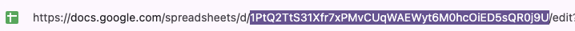

# Reveal-Quiz-Game
A quiz game intended to played in-person.  

### features
- Clues stored in Google Sheets
  - clues can be downloaded for offline play 
- Google Forms for creating clues and answers 
- Clues can include Text, Video, Audio and Images 
- Supports 12 players.   

Made with [Reveal.js](https://revealjs.com/)

## Getting Started

1. A Google Account is required to copy the Google Sheets and Google Forms. 

Copy this Google Sheet to your Google Drive.  

> [Quiz Game - Google Sheet](https://docs.google.com/spreadsheets/d/15268vmqaTuGxiRqAtylkLjOmS8P5J1QZaTJ_vIyf1Ns/copy)

> [Tip]
> Move the copied files to a folder in your Google Drive

2. Publish the Google Forms that comes with the "Quiz Game" Google Sheet
Google forms are used to add new clues and categories. 
There are 2 versions of the input form.  One Form creates clues that can include Text, Images, Audio or Video. The other Form creates Text only clues. 

Open the Forms and click the "Publish" Button

Share the Form link with others to add Clues and Categories. 
   
3. Choose the Categories for the Game.

In the "Quiz Game" Sheets use the "Selected Categories" tab to choose categories    

4. Share the "Quiz Game" Sheets

Click the "Share" button, then set the the "General Access" to "Anyone with the link"

5. Copy the Quiz Game Sheets ID

In your browsers address bar copy the Sheet ID.  
- the Sheets ID is between the */d/* and */edit*  

6. Start the Quiz Game

The Quiz Game is hosted on Github.  

   > [Start Quiz Game Github page ](https://uuoocl.github.io/Quiz-Game/)

To load your Quiz game, 
- click the "Google Sheets" button.  
- Paste your Sheets ID.
- click "Start Game"

## Offline Play

> [!TIP]
> Optionally the clues can be downloaded for offline game play.

1. 
2. Open the Quiz Game Sheet's "Games-Download" tab 
3. In the file menu, choose File -> Download -> Tab Seperated Values
4. Save the .tsv file in the main project folder.
5. Open the quiz-game.html file
- Google Drive notes
Photos, Videos and Audio submitted in the Google Form will be stored in your Google Drive.  Download these files to the "media" folder. 

## Controllers

Norwii brand wireless presentation remotes are used to play the game.  These remotes come with a customization software where each button can be set to a certain key.  

The "Host" is controller is a Norwii [N28](https://www.amazon.com/dp/B081SY17DC) or [N29](https://www.amazon.com/dp/B07HH4PFNQ).

The "Players" controllers are model [N26](https://www.amazon.com/dp/B01NC2VS6I)

|Controller      |Key      |Button| JS Code| Norwii Hex Code
|:-----|:-----|:-----|:-----|:-----|
|Host      |1      |>|49|   0x1E|
|Host      |0     |<|48|   0x27|
|Host      |Tab      |口| 9|   0x2B|
|Host      | Shift + Tab   |口| 9| 0x2B  |
|Host      |3     |+|51|   0x20|
|Host      |Left Arrow     |-|37|   0x50|
|Player1      |F13      | ∧ and ∨|124| 0x68  |
|Player2      |F14      |∧ and ∨|125|  0x69 |
|Player3      |F15      |∧ and ∨|126|  0x6A |
|Player4      |F16      |∧ and ∨|127|  0x6B |
|Player5      |F17      |∧ and ∨|128|  0x6C |
|Player6      |F18      |∧ and ∨|129|  0x6D |
|Player7      |F19      |∧ and ∨|130|  0x6E |
|Player8      |F20      |∧ and ∨|131|  0x6F |
|Player9      |F21      |∧ and ∨|132|  0x70 |
|Player10      |F22      |∧ and ∨|133|  0x71 |
|Player11      |F23      |∧ and ∨|134|  0x72 |
|Player12      |F24      |∧ and ∨|135|  0x73 |

a [Sabrent 13 port USB hub](https://www.amazon.com/dp/product/B00HL7Z46K/) can be used to connect the controllers to a PC

# Playing the Game
Use the "s" key to view the host notes. The host notes are provided to give the host instrucitons for each screen.  
